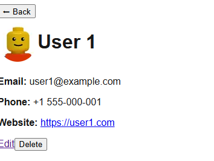

# User Dashboard POC with Next.js, React, and TypeScript

This project is a simple Proof of Concept (POC) for a user dashboard built with Next.js, React, and TypeScript, styled with Tailwind CSS. It features user listing, pagination, user detail views, and user editing with simulated data persistence.

---

 


## Features Implemented

### 1. User Listing with Pagination

- `/` (Home) page displays a paginated list of users.
- Pagination controls allow navigation between pages.
- Each user in the list links to their detail page.

### 2. User Detail Page

- Dynamic route `/users/[id]` displays detailed info about a user.
- Shows user avatar, name, email, phone, and website.
- Includes buttons for editing or deleting the user (delete is simulated).

### 3. User Edit Page

- Dynamic route `/users/[id]/edit` allows editing user details.
- Form pre-populates with existing user data.
- Updates user data in a mock data array on save (simulated persistence).
- Redirects back to user detail page after saving.

### 4. Mock Data Service

- User data is stored in an in-memory `mockUsers` array.
- Utility functions:
  - `getUsers(page, limit)` - paginate user list.
  - `getUserById(id)` - get a single user by ID.
  - `addUser(user)` - add a new user.
  - `updateUser(id, updatedUserData)` - update existing user data.
  - `deleteUserById(id)` - delete user by ID.
- User avatars are generated dynamically using Lego avatar URLs.

---

## Project Structure

```
src/
├── components/
│   ├── SearchBar/
│   │   ├── SearchBar.tsx
│   │   └── SearchBar.styles.ts
│   ├── UserCard/
│   │   ├── UserCard.tsx
│   │   └── UserCard.styles.ts
│   └── UserForm/
│       ├── UserForm.tsx
│       └── UserForm.styles.ts
│
├── pages/
│   ├── AboutPage/
│   │   ├── index.tsx
│   │   └── AboutPage.styles.ts
│   ├── AddUserPage/
│   │   ├── index.tsx
│   │   └── AddUserPage.styles.ts
│   ├── HomePage/
│   │   ├── index.tsx
│   │   └── HomePage.styles.ts
│   └── users/
│       └── [id]/
│           ├── edit.tsx
│           ├── index.tsx
│           ├── EditUser.styles.ts
│           └── UserDetail.styles.ts
│
├── services/
│   └── userService.ts
│
├── types/
│   └── User.ts
│
└── styles/
    └── globals.css

````

## Getting Started

First, run the development server:

```bash
npm run dev
# or
yarn dev
# or
pnpm dev
# or
bun dev
```

Open [http://localhost:3000/HomePage](http://localhost:3000/HomePage) with your browser to see the result.